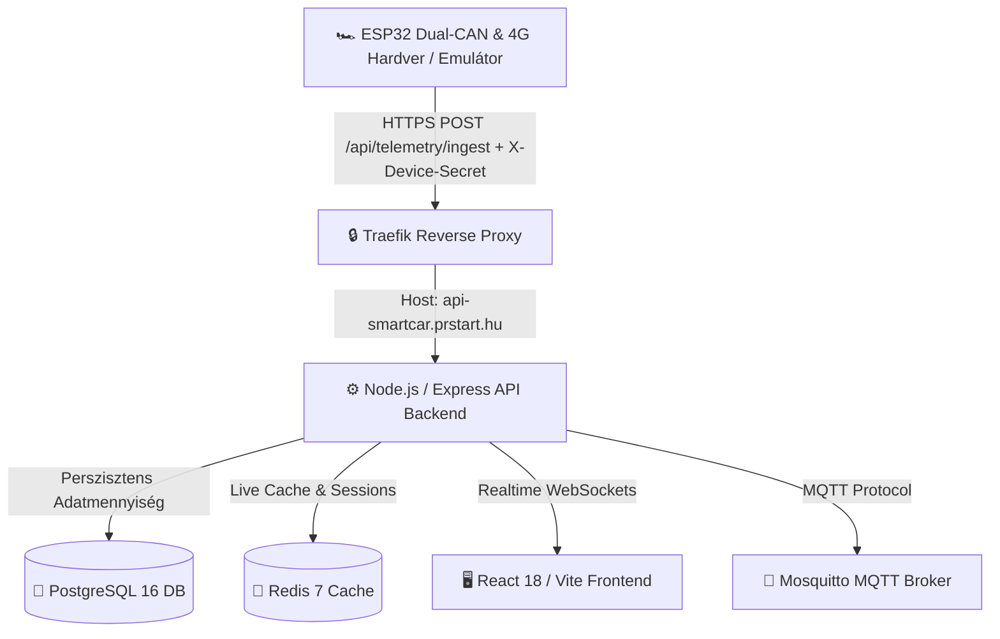

# 🚗 SmartCar Telematics & Remote Vehicle Control System

> **Ipari minőségű, élesben futó telematikai, távvezérlési és 4G IoT járműkövető platform.**
> Éles webes felület: **[https://smartcar.prstart.hu](https://smartcar.prstart.hu)**  
> Éles API végpont: **[https://api-smartcar.prstart.hu](https://api-smartcar.prstart.hu)**

---

## 📌 Tartalomjegyzék
1. [Rendszer Áttekintés & Architektúra](#-rendszer-áttekintés--architektúra)
2. [Főbb Funkciók](#-főbb-funkciók)
3. [Hardver Biztonság & Behatolásvédelem (Security Hardening)](#-hardver-biztonság--behatolásvédelem-security-hardening)
4. [DBeaver Adatbázis Elérés (SSH Alagút)](#-dbeaver-adatbázis-elérés-ssh-alagút)
5. [1 Éves Telemetria Gyűjtés & Nyomvonal Lekérdezés](#-1-éves-telemetria-gyűjtés--nyomvonal-lekérdezés)
6. [Támogatott CAN Busz Profil Matrix](#-támogatott-can-busz-profil-matrix)
7. [Fejlesztői & Szerver Deploy Útmutató](#-fejlesztői--szerver-deploy-útmutató)
8. [Környezeti Változók (.env)](#-környezeti-változók-env)

---

## 🏗️ Rendszer Áttekintés & Architektúra

A **SmartCar Telematics** egy mikroarchitektúrára épülő, valós idejű telematikai és IoT flottakezelő rendszer. A járművekbe szerelt Dual-CAN mikrokontrollerek (ESP32) 4G mobilhálózaton keresztül HTTPS REST API csatornán közvetítik a járművek helyzetét, CAN-busz adatait és diagnosztikai kóddatait (DTC).



### Technológiai Stakk:
- **Frontend:** React 18, Vite, Vanilla CSS design tokens (Glassmorphism), Lucide React Ikonok, Leaflet Maps (Inline SVG Marker & Polyline nyomvonalkövetés).
- **Backend:** Node.js (v20), Express, Socket.IO (valós idejű szinkronizáció), JWT Hitelesítés.
- **Adatbázis & Cache:** PostgreSQL 16 (1 éves telemetria előzmény tárolás, indexelt lekérdezés), Redis 7.
- **IoT Ingest & Üzenetküldés:** Universal 4G HTTPS Telemetry Ingest (`/api/telemetry/ingest`), Eclipse Mosquitto MQTT v2.
- **Infrastruktúra:** Docker Compose, Traefik v2 (SSL Let's Encrypt Letöltés & HTTPS TLS routing), `marcika` szerver (`193.31.27.135`).

---

## ⚡ Főbb Funkciók

- **🚗 Többjárműves Flottakezelés:** Gördülékeny autóváltó a fejléces menüben és az albarban (Mercedes-Benz GL 320, Renault Fluence, BMW 530d).
- **🕹️ Távvezérlés (Remote Control):** Központi zár nyitás/zárás, ablakok fel/lehúzása, napfénytető és csomagtér ajtó nyitása valós idejű CAN paranccsal.
- **🗺️ GPS Élő Térkép & Útvonal Előzmények:** Valós idejű helymeghatározás 404-mentes cyan SVG ikonokkal és 24h / 7d / 30d / 1y időszaki Polyline nyomvonal kirajzolással.
- **🚨 DTC Diagnosztika (OBD2 Fehlercodes):** Hibakód olvasás modulonként (ECM, ESP, ABS) részletes magyar leírással és törlési funkcióval.
- **🛡️ Biztonsági Audit Napló (Intrusion Detection Console):** Az illetéktelen behatolási kísérletek és hamis adatok valós idejű rögzítése és adminisztrátori elemzése.
- **🔧 Szervizes Bekötési Kézikönyv:** Autómodell-specifikus kábelbekötési útmutató szervizeseknek (OBD2 PIN-kiosztás, CAN-B/C sebességek).

---

## 🛡️ Hardver Biztonság & Behatolásvédelem (Security Hardening)

A hamis adatok és külső támadások megelőzésére a rendszer 5 szintű védelmi vonalat alkalmaz:

1. **🔑 Hardver Titkosítás (`X-Device-Secret` Header):**
   - Minden telemetriai adatcsomag tartalmazza a mikrokontroller egyedi titkos kulcsát (`X-Device-Secret` header vagy `secret` JSON mező).
   - Érvénytelen kulcs esetén a backend azonnal `HTTP 401 Unauthorized` hibát ad és eldobja a csomagot.
2. **📜 PostgreSQL Security Audit Logging:**
   - A szerver minden illegális próbálkozást eltárol a `security_audit_logs` táblában:
     - **Forrás IP-cím** (pl. `46.107.46.161`)
     - **Támadás Típusa** (`UNAUTHORIZED_TELEMETRY_ATTEMPT`)
     - **Próbált VIN & Eszköz ID**
     - **Próbált Kulcs** (pl. `NONE` vagy hibás token)
     - **Kliens User-Agent** (pl. `curl/8.5.0`, `Postman`)
3. **📊 Admin Audit Napló Konzol:**
   - Az Admin felületen a **`🛡️ Biztonsági Napló`** fülön élőben kereshető és szűrhető a kivédett behatolások listája.

---

## 🔌 DBeaver Adatbázis Elérés (SSH Alagút)

A PostgreSQL adatbázis nincs kitéve a nyilvános internetre. Elérése **DBeaver SSH Tunneling** segítségével lehetséges:

### DBeaver Beállítások:

#### 1. `SSH` Fül:
- **SSH Host:** `193.31.27.135` *(vagy `prstart.hu`)*
- **Port:** `22`
- **User Name:** `alphaws`
- **Authentication:** `Public Key` *(vagy jelszó)*

#### 2. `Main` Fül:
- **Host:** `localhost`
- **Port:** **`5434`** *(Exponálva a szerveren: `127.0.0.1:5434`)*
- **Database:** `smartcar_telematics`
- **Username:** `your_db_user`
- **Password:** `your_secure_db_password`

---

## 📅 1 Éves Telemetria Gyűjtés & Nyomvonal Lekérdezés

A szerver a járművek összes telemetriai pontját perszisztensen tárolja a PostgreSQL `telemetry_history` táblájában.

### REST API Lekérdezés:
```http
GET /api/vehicles/:vin/history?range=24h|7d|30d|1y
Authorization: Bearer <JWT_TOKEN>
```

### Éves Adatkapacitás Számítás (1 autó / 1 év):
- **Adatbázis méret:** ~138 MB / év / autó
- **Mobil 4G adatforgalom:** ~175 MB / év / autó

---

## 🏎️ Támogatott CAN Busz Profil Matrix

| Autómodell / Platform | CAN-B (Komfort) | CAN-C (Motor/Hajtás) | Állapot |
| :--- | :--- | :--- | :--- |
| **Renault Fluence / Mégane III / Scénic III** | 250 kbps | 500 kbps | Verifikált ✅ |
| **Renault Clio IV / Captur I / Dacia Duster II** | 250 kbps | 500 kbps | Verifikált ✅ |
| **Mercedes-Benz ML / GL / R-Class (W164 / X164)** | 83.3 kbps | 500 kbps | Verifikált ✅ |
| **Mercedes-Benz E-Class / C-Class (W212 / W204)** | 83.3 kbps | 500 kbps | Verifikált ✅ |
| **BMW 5 / 3 / 1 Series (E60 / E90 / E87 K-CAN)** | 100 kbps | 500 kbps | Verifikált ✅ |
| **BMW 3 / 4 / 5 Series (F30 / F10 / F15 K-CAN2)** | 500 kbps | 500 kbps | Verifikált ✅ |
| **Volkswagen / Audi / Skoda / Seat (MQB / PQ35)** | 500 kbps | 500 kbps | Verifikált ✅ |
| **Ford Focus MK2/MK3 / Mondeo MK4 (MS-CAN)** | 125 kbps | 500 kbps | Verifikált ✅ |
| **Nissan Qashqai J10/J11 / X-Trail T31/T32** | 250 kbps | 500 kbps | Verifikált ✅ |
| **Opel / Vauxhall Astra J / Insignia A (SW-CAN)** | 33.3 kbps | 500 kbps | Tesztelés alatt 🧪 |

---

## 🚀 Fejlesztői & Szerver Deploy Útmutató

### 1. Lokális Fejlesztés & Emulátorok Indítása:
```bash
cd /home/alphaws/Dev/Projects/smartcar-telematics
docker compose up -d --build
```

### 2. Éles Szerver Deploy (`marcika` / `prstart.hu`):
A projekt a Git-alapú CD (Continuous Deployment) workflow-t követi:
```bash
git add .
git commit -m "Új funkció vagy biztonsági frissítés"
git push origin main

# Szerver oldali frissítés és image újraépítés (DOCKER BUILD RULE)
ssh marcika "cd /var/www/smartcar-telematics && git pull && cp docker-compose.prod.yml docker-compose.yml && docker compose up -d --build"
```

---

## 🔐 Környezeti Változók (.env)

```env
NODE_ENV=production
PORT=5000

# PostgreSQL Adatbázis Konfiguráció
POSTGRES_USER=your_db_user
POSTGRES_PASSWORD=your_secure_db_password
POSTGRES_DB=smartcar_telematics
DB_HOST=postgres
DB_PORT=5432

# Redis & Mosquitto Broker
REDIS_URL=redis://redis:6379
MQTT_BROKER_URL=mqtt://mosquitto:1883

# Biztonsági Kulcsok
JWT_SECRET=your_super_secret_jwt_key
HARDWARE_SECRET=smartcar_esp32_hw_secret_key_2026
```

---

*SmartCar Telematics & Remote Vehicle Control System — Utolsó frissítés: 2026. július 21.*
